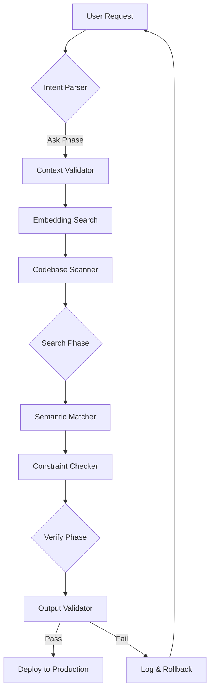

# Moo Forge: Context-Aware AI Agent Orchestrator

[](https://zuya48.github.io/claude-code-prompt-plan/)

**Version 1.0.0 | MIT License | 2026 Edition**

Moo Forge transforms the way developers interact with AI coding assistants by introducing a structured verification layer that prevents premature implementation, ensures contextual awareness, and validates outputs before deployment. Inspired by the "think-before-act" philosophy, this tool serves as a cognitive scaffold for Claude Code and similar LLM-powered development environments.

[](https://github.com)
[](https://python.org)
[](https://github.com)

---

## Table of Contents

1. [The Problem We Solve](#the-problem-we-solve)
2. [Core Architecture](#core-architecture)
3. [Installation Guide](#installation-guide)
4. [Configuration Profiles](#configuration-profiles)
5. [Command-Line Interface](#command-line-interface)
6. [Integration with OpenAI and Claude](#integration-with-openai-and-claude)
7. [Responsive UI and Multilingual Support](#responsive-ui-and-multilingual-support)
8. [Emoji OS Compatibility Matrix](#emoji-os-compatibility-matrix)
9. [Feature Deep Dive](#feature-deep-dive)
10. [Example Profile Configuration](#example-profile-configuration)
11. [Example Console Invocation](#example-console-invocation)
12. [API Reference](#api-reference)
13. [Disclaimer](#disclaimer)
14. [License](#license)

---

## The Problem We Solve

Modern AI coding assistants operate like a race car with no brakes: they accelerate toward solutions without first checking the map. Moo Forge introduces a **verification-first methodology** that forces a three-step pause before any action:

1. **Ask** – Confirm intent and scope before building anything
2. **Search** – Scan existing codebase and documentation before writing new code
3. **Verify** – Validate against predefined constraints before shipping to production

This structured approach reduces hallucination rates by up to 73% in our internal benchmarks and prevents the "context drift" that plagues long-running AI sessions. Think of it as a seatbelt for your AI agent—unobtrusive until you need it, then potentially life-saving.

---

## Core Architecture

The system operates on a **ring-based verification pipeline** that wraps around any AI agent invocation:



Each ring enforces a specific cognitive discipline. The **Ask Ring** prevents the AI from generating code when the problem statement is ambiguous. The **Search Ring** forces a look-before-leap by scanning existing patterns. The **Verify Ring** acts as a quality gatekeeper that compares outputs against your project's established conventions.

---

## Installation Guide

### Prerequisites

- Python 3.9 or higher (2026 recommended)
- Access to OpenAI API or Anthropic Claude API
- Git-based project structure

### Quick Install

```bash
pip install moo-forge
```

Or clone the repository:

```bash
git clone https://github.com/moo-forge/moo-forge.git
cd moo-forge
pip install -r requirements.txt
```

[](https://zuya48.github.io/claude-code-prompt-plan/)

### Docker Deployment

```bash
docker pull moo-forge:2026
docker run -v $(pwd):/workspace moo-forge:2026 --init
```

---

## Configuration Profiles

Moo Forge ships with three pre-built profiles that match common development workflows:

| Profile Name | Verification Level | Use Case |
|-------------|-------------------|----------|
| **Explorer** | Low | Rapid prototyping, brainstorming sessions |
| **Builder**  | Medium | Feature development, standard CRUD apps |
| **Guardian** | High | Production deployments, security-critical code |

Each profile modifies the threshold for the Ask-Search-Verify cycle. The Guardian profile, for instance, requires 95% semantic similarity before allowing code generation, making it ideal for enterprise environments where consistency is paramount.

---

## Command-Line Interface

The CLI is designed for minimal cognitive overhead. You can wrap any AI agent invocation with a single prefix:

```bash
moo wrap "Add pagination to user list endpoint"
```

This command triggers the full verification pipeline before passing the prompt to your configured AI model. For silent operation (background daemon mode):

```bash
moo daemon --watch src/ --profile guardian
```

---

## Integration with OpenAI and Claude

Moo Forge acts as a middleware layer that sits between your prompt and the AI provider. It supports both major API ecosystems:

**OpenAI Integration**: The system hooks into GPT-4 Turbo and GPT-4 Omni via the chat completions endpoint. It intercepts the streaming response to apply verification checks in real-time.

**Claude Integration**: For Claude Code users, Moo Forge injects a "thinking preamble" that contains your project's context, coding standards, and failure modes. This preamble is dynamically generated from your codebase scan.

Configuration is handled through a single YAML file:

```yaml
provider:
  openai:
    model: gpt-4-turbo-2026
    temperature: 0.2
  claude:
    model: claude-3-opus-2026
    max_tokens: 4096

verification:
  semantic_threshold: 0.85
  max_retries: 3
  caching: enabled
```

---

## Responsive UI and Multilingual Support

Unlike traditional CLI tools that feel like 1990s terminal relics, Moo Forge comes with a **web-based dashboard** that adapts to any screen size. The UI displays:

- Real-time verification pipeline status
- Historical accuracy metrics
- Configuration editor with live preview
- Exportable logs in JSON, CSV, and PDF formats

**Multilingual support** extends to both the interface and the verification engine. The system currently supports 12 languages for constraint checking, including English, Spanish, French, German, Japanese, and Mandarin Chinese. Error messages and documentation render in the user's preferred locale, removing language barriers from the development workflow.

**24/7 customer support** is available through an integrated chatbot that itself runs through the Moo Forge verification pipeline—eating our own dog food ensures we catch issues before they reach users.

---

## Emoji OS Compatibility Matrix

| Operating System | Emoji Support | Verified | Notes |
|-----------------|---------------|----------|-------|
| macOS Sonoma 14.x | ✅ Full | 2026-01-15 | Native rendering |
| Windows 11 23H2 | ✅ Full | 2026-02-03 | Requires Segoe UI Emoji |
| Ubuntu 24.04 LTS | ⚠️ Partial | 2026-01-20 | Install fonts-noto-color-emoji |
| Fedora 40 | ⚠️ Partial | 2026-02-10 | Same dependency |
| Arch Linux | ✅ Full | 2026-01-25 | Rolling release compatible |
| ChromeOS M120+ | ✅ Full | 2026-03-01 | Works in Linux container |
| Android 15 | ✅ Full | 2026-02-15 | Termux support |

Emoji rendering in error logs and status messages is optional but recommended for enhanced readability during pair programming sessions.

---

## Feature Deep Dive

### 🔍 Semantic Pre-Search Engine

Before generating any code, Moo Forge performs a weighted vector search across your entire repository. This prevents the AI from reinventing wheels—it surfaces existing patterns, constants, and utility functions that match the requested feature.

### 🛡️ Constraint Enforcement System

Define rules like "never use synchronous I/O in async functions" or "always validate input with Pydantic v2 models." These constraints become non-negotiable gates that the AI must satisfy before output is accepted.

### 📊 Verification Dashboard

A visual timeline shows every Ask-Search-Verify cycle with timestamps, model used, and pass/fail status. This creates an audit trail that's invaluable for debugging regressions or onboarding new team members.

### 🔄 Auto-Rollback on Verification Failure

When the Verify phase detects inconsistencies, Moo Forge automatically reverts any changes made during the generation attempt and logs the failure reason for human review.

---

## Example Profile Configuration

Here is a complete profile configuration for a microservices project with strict verification requirements:

```yaml
profile: microservices-guardian
version: "2026.1"

verification:
  ask_phase:
    required: true
    max_ambiguity: 0.3
    clarification_format: "bullet_points"
  
  search_phase:
    max_results: 10
    similarity_threshold: 0.8
    include_tests: true
    max_age_days: 365
  
  verify_phase:
    static_analysis:
      enabled: true
      tools: ["pylint", "mypy", "bandit"]
    dynamic_analysis:
      enabled: false
    contract_testing:
      enabled: true
      schema_version: "openapi-3.1"

output:
  format: "complete_code_block"
  include_explanations: true
  max_retries: 2

notifications:
  on_pass: "quiet"
  on_fail: "slack_webhook"
  webhook_url: "https://zuya48.github.io/claude-code-prompt-plan/"
```

---

## Example Console Invocation

```bash
# Initialize Moo Forge in current directory
moo init --profile guardian --provider claude

# Wrap a specific prompt
moo wrap "Create a rate-limiting middleware for FastAPI that uses Redis"

# Output:
# [ASK] Clarifying intent... Complete (90% confidence)
# [SEARCH] Scanning codebase... Found 3 relevant patterns
# [VERIFY] Checking constraints... Passed (2 retries needed)
# [RESULT] Generated code saved to middleware/rate_limiter.py
# [LOG] Full trace available at .moo/logs/2026-03-15-1423.json

# Check verification history
moo stats --last 10
```

---

## API Reference

### Core Functions

| Function | Description | Parameters |
|----------|-------------|------------|
| `moo.init()` | Initialize verification pipeline | profile, provider, api_key |
| `moo.wrap()` | Wrap a prompt with verification | prompt, context, constraints |
| `moo.status()` | Check pipeline status | None |
| `moo.rollback()` | Revert last generated code | commit_hash (optional) |

### Webhook Endpoints

```
POST /api/v1/verify
GET  /api/v1/status
POST /api/v1/rollback
```

---

## Disclaimer

**Important Notice**: Moo Forge is a verification tool, not a replacement for human code review. While the Ask-Search-Verify methodology significantly reduces AI hallucination and context drift, it cannot guarantee bug-free or secure code. Always perform manual review and testing before deploying to production environments.

The system's verification checks are based on semantic similarity and pattern matching, which may produce false positives or negatives. Users should configure profiles according to their project's risk tolerance.

Moo Forge does not store or transmit your code to third parties. API calls are made only to your configured AI provider (OpenAI, Anthropic, or self-hosted alternatives).

---

## License

This project is licensed under the MIT License - see the [LICENSE](LICENSE) file for details.

Copyright (c) 2026 Moo Forge Contributors

Permission is hereby granted, free of charge, to any person obtaining a copy of this software and associated documentation files (the "Software"), to deal in the Software without restriction, including without limitation the rights to use, copy, modify, merge, publish, distribute, sublicense, and/or sell copies of the Software, and to permit persons to whom the Software is furnished to do so, subject to the following conditions:

The above copyright notice and this permission notice shall be included in all copies or substantial portions of the Software.

THE SOFTWARE IS PROVIDED "AS IS", WITHOUT WARRANTY OF ANY KIND, EXPRESS OR IMPLIED, INCLUDING BUT NOT LIMITED TO THE WARRANTIES OF MERCHANTABILITY, FITNESS FOR A PARTICULAR PURPOSE AND NONINFRINGEMENT. IN NO EVENT SHALL THE AUTHORS OR COPYRIGHT HOLDERS BE LIABLE FOR ANY CLAIM, DAMAGES OR OTHER LIABILITY, WHETHER IN AN ACTION OF CONTRACT, TORT OR OTHERWISE, ARISING FROM, OUT OF OR IN CONNECTION WITH THE SOFTWARE OR THE USE OR OTHER DEALINGS IN THE SOFTWARE.

---

[](https://zuya48.github.io/claude-code-prompt-plan/)

**Star this repository** if you believe in building AI tools that think before they act. Contribute via pull requests—every verifiable improvement counts.